# Sprout

Sprout is a recipe sharing website where users can view recipes. Logged in users can post recipes and comment on posted recipes

Visit the deployed site here: [Sprout](https://sprout-p4-ffedffefc60e.herokuapp.com/)

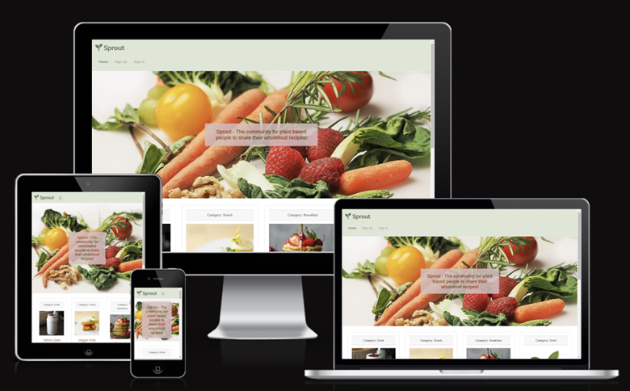

## Contents

- [Sprout](#sprout)
  - [Contents](#contents)
- [User Experience (UX)](#user-experience-ux)
  - [Initial Discussion](#initial-discussion)
  - [Agile Planning](#agile-planning)
    - [Epics](#epics)
      - [Epic 1 – Initial Setup](#epic-1--initial-setup)
      - [Epic 2 – Create Pages](#epic-2--create-pages)
      - [Epic 3 – Recipes](#epic-3--recipes)
      - [Epic 4 – Comments](#epic-4--comments)
      - [Epic 5 – Authentication](#epic-5--authentication)
      - [Epic 6 – Deployment](#epic-6--deployment)
      - [Epic 7 – Testing and Documentation](#epic-7--testing-and-documentation)
    - [User Stories](#user-stories)
      - [Epic 1 – Initial Setup](#epic-1--initial-setup-1)
      - [Epic 2 – Create Pages](#epic-2--create-pages-1)
      - [Epic 3 – Recipes](#epic-3--recipes-1)
      - [Epic 4 – Comments](#epic-4--comments-1)
      - [Epic 5 – Authentication](#epic-5--authentication-1)
      - [Epic 6 – Deployment](#epic-6--deployment-1)
      - [Epic 7 – Testing and Documentation](#epic-7--testing-and-documentation-1)
- [Design](#design)
  - [Colour Scheme](#colour-scheme)
  - [Typography](#typography)
  - [Imagery](#imagery)
    - [Hero Image](#hero-image)
    - [Favicon](#favicon)
    - [Recipe Images](#recipe-images)
  - [Wireframes](#wireframes)
    - [Home Page](#home-page)
    - [Recipe Detail](#recipe-detail)
    - [User Recipes](#user-recipes)
    - [Create and Edit Recipe](#create-and-edit-recipe)
  - [Database Design](#database-design)
  - [Features](#features)
    - [Existing Features](#existing-features)
      - [Navigation Bar](#navigation-bar)
      - [Footer](#footer)
      - [Home Page](#home-page-1)
        - [Pagination](#pagination)
      - [Add Recipe Page](#add-recipe-page)
      - [My Recipes](#my-recipes)
      - [Recipe Detail Page](#recipe-detail-page)
      - [Edit Recipe](#edit-recipe)
      - [Delete Recipe](#delete-recipe)
      - [Log In](#log-in)
      - [Sign Up](#sign-up)
      - [Log Out](#log-out)
      - [404.html / 403.html / 500.html](#404html--403html--500html)
  - [Future Implementations](#future-implementations)
  - [Accessibility](#accessibility)
    - [Wave Validator](#wave-validator)
      - [Home Page](#home-page-2)
      - [Recipe Detail](#recipe-detail-1)
      - [User Recipes](#user-recipes-1)
      - [Create Recipe](#create-recipe)
      - [Edit Recipe](#edit-recipe-1)
      - [Delete Recipe](#delete-recipe-1)
      - [Log In](#log-in-1)
      - [Sign Up](#sign-up-1)
      - [Log Out](#log-out-1)
      - [404.html / 403.html / 500.html](#404html--403html--500html-1)
- [Technologies Used](#technologies-used)
  - [Languages Used](#languages-used)
  - [Frameworks, Libraries and Programs Used](#frameworks-libraries-and-programs-used)
  - [Deployment and Local Development](#deployment-and-local-development)
    - [Heroku](#heroku)
    - [How to Fork](#how-to-fork)
    - [How to Clone](#how-to-clone)
- [Testing](#testing)
- [Bugs](#bugs)
  - [Resolved Bugs](#resolved-bugs)
  - [Unresolved Bugs](#unresolved-bugs)
- [Credits](#credits)
  - [Code Used](#code-used)
  - [Content](#content)
  - [Media](#media)
  - [Other](#other)
  - [Acknowledgements](#acknowledgements)

[Back to top](#sprout)

# User Experience (UX)

## Initial Discussion

Sprout is a recipe sharing website which allows users to post recipes, rate recipes and leave comments on the recipe.

The site is designed to be intuitive and provide a enjoyable user experience.

Security is an important part of the site – ensuring user data is kept secure and, unauthorised users aren’t able to access or change parts of the site if they are not authorised to do so.

## Agile Planning

This site was produced using Agile Methodologies. The project was designed in 6 sprints with use sprint planned each half week. I used Github’s Project Board to plan this project.

Projects were broken down in the following ways:

Priorities – Tasks were labelled must-have, should-have or nice-to-have. The must-have tasks were prioritized.

Estimates – These were assigned on the expected complexity of a task and how long I expected it to take to complete. The simplest tasks in the project were assigned an estimate of 1 and, the task I thought was most complex was assigned an estimate of 8. The estimates are shown in the light grey label on the project board. In total there were 101 estimates. 40 of these were must-haves (39.5%), 22 were should-haves (22%) and 39 were nice-to-haves (38.5%)

All cards on the project board can be opened to see the full critea that needs to be met in order to close the task. The full project board can be found here: [Project Board](#<https://github.com/users/Gkicks/projects/6/views/1)>

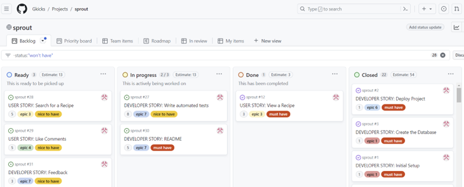

### Epics

The project was broken down into 7 Epics. These were:

#### Epic 1 – Initial Setup

Setting up the coding environment, installing necessary libraries, creating the project and app, creating a superuser and creating the databases

#### Epic 2 – Create Pages

Creating the structure of the website and the individual pages that make up this project

#### Epic 3 – Recipes

Functionality to create, view, edit and delete a recipe

#### Epic 4 – Comments

Functionality to create, view, edit and delete comments relating to a specific recipe

#### Epic 5 – Authentication

Allows the user to register an account, login, logout and delete an account

#### Epic 6 – Deployment

The website to be deployed to Heroku

#### Epic 7 – Testing and Documentation

Testing the website to ensure it is working as it should. Completing README documentation

### User Stories

Each Epic was further broken down into User Stories:

#### Epic 1 – Initial Setup

• As a developer I need to create a PostgresSQL instance, using ElephantSQL, so I can set up models – estimate 1 – must-have
• As a developer I need to set up the developing environment so that I can implement the necessary features – estimate 1 – must-have
• As a developer I need to create a superuser so I can have admin access to the database – estimate 1 – must have
• As a developer I need to create static resources to contain my css and js files and images – estimate 1 - must have

#### Epic 2 – Create Pages

• As a developer I need to create the base.html page to give the structure that other page layouts are based on – estimate 2 – must have
• As a developer I need to create a navbar so that the user can navigate throughout the site – estimate 2 – must have
• As a developer I need to create a footer so that the user can link to the social media accounts - estimate 2 – must have
• As a developer I need to create a home / landing page where the user can easily see the recipe posts – estimate 3 – must have
• As a user I want to see a list of my current recipes so I can see the recipes I've published and choose which to edit or delete – estimate 5 – must have
• As a developer I want to create a 404 error page so that users are alerted if they have accessed a page that doesn’t exist – estimate 2 – should have
• As a developer I want to create a 403 error page so that users are alerted if they have accessed a page they don't have permission to view – estimate 2 – should have
• As a developer I want to create a 500 error page so that users are alerted if an internal error occurs – estimate 2 – should have

#### Epic 3 – Recipes

- As a user I want to create a recipe post so that I can share my recipe with other users – estimate 5 – must have
- As a user I want to click on a recipe post which will open in a new page so I can see the full recipe – estimate 3 – must have
- As a user I want to edit a recipe so I can correct any errors or make updates – estimate 3 – must have
- As a user I want to delete a recipe so I can stop sharing it with other users – estimate 3 – must have
- As a user I want to filter by type of recipe (main, sides, etc) so I can just see the recipes for want I am planning to make – estimate 5 – should have
- As a user I want to like or dislike a recipe to help other users make a decision about making a recipe – estimate 5 – should have
- As a user I want to search for a recipe to find a recipe if I already have an idea of what I’m looking for – estimate 5 – nice to have
- As a user I am able to rate a recipe to inform others how much I liked the recipe – estimate 5 – nice to have

#### Epic 4 – Comments

- As a user I want to comment on a recipe so I can give feedback to the author and share my views with other users – estimate 3 – should have
- As a user I want to view comments that all users have left so that I can see feedback on a recipe – estimate 2 – should have
- As a user I want to edit a comment so I can correct any errors or make updates – estimate 3 – should have
- As a user I want to delete a comment so I can stop sharing it with other users – estimate 3 – should have
- As a user I want to like comments to help other users make a decision how helpful that comment is – estimate 5 – nice to have

#### Epic 5 – Authentication

- As a developer I need to install allauth so the user can register an account, login and logout – estimate 2 - must have
- As a site owner I want the allauth forms to be customised so they fit in with the style of the rest of the site – estimate 5 – should have
- As a user I want to delete my account so it no longer exists – estimate 3 – should have

#### Epic 6 – Deployment

- As a developer I need to deploy the project, to Heroku, so that customers are able to access the website – estimate 1 – must-have

#### Epic 7 – Testing and Documentation

- As a developer I want to complete automated testing so I can make sure all area of the website are working as they should be – estimate 8 – must have
- As a developer I need to write a README so that all information regarding the project is easily understood by those who need to – estimate 5 – must have
- As a developer I would like to get feedback from other users so I can see if my project is commercially viable – estimate 3 - nice to have

[Back to top](#sprout)

# Design

## Colour Scheme

I chose the following palette for my colour scheme. This wasn’t a standard palette but ,  one I put together, by looking at colour palettes on Coolers and Piniterest and picking colours that complemented each other and suited the theme of the website

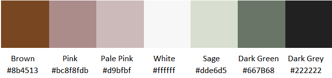

The only deviations to these colours were for the buttons. I initially used the standard Bootstrap classes – btn-outline-warning, btn-outline-success and btn-outline-danger – for these but, the yellow and green colours failed the Wave Validator for contrast. 

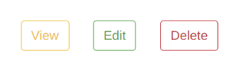

I then changed these for the yellow button to become purple (I could not find a yellow or orange tone I liked that passed validation) and the green to a darker green

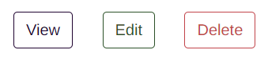

## Typography

I used FontJoy to pick the fonts used throughout the website. The fonts used are Arimo and Kanit. I was originally planning to use Poly too but decided this wasn’t necessary and having two fonts was enough 

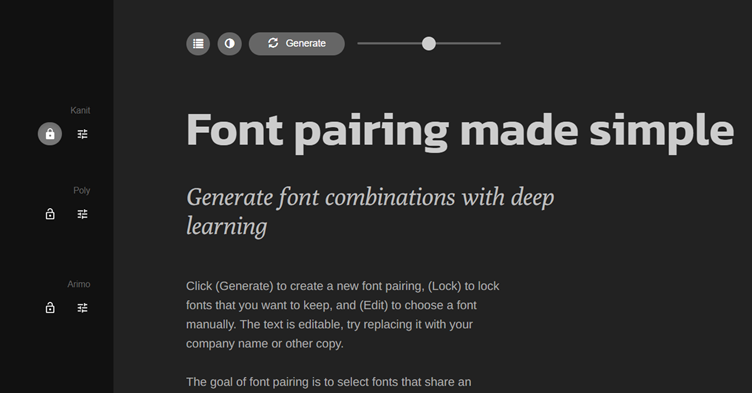

## Imagery

### Hero Image

The hero image was found on Pixabay and the bright, fresh colours and fruit and veg imagery match the site’s ethos

### Favicon

The favicon image I chose to use was of a sprout, as this matches the name of the site. This image is also used as a default image if a user doesn’t upload their own image

### Recipe Images

Recipe Images were found on Upsplash and Pixabay

## Wireframes

Wireframes were created using Figma.com

### Home Page

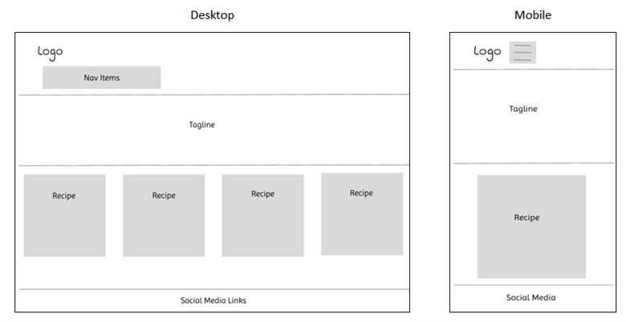

### Recipe Detail

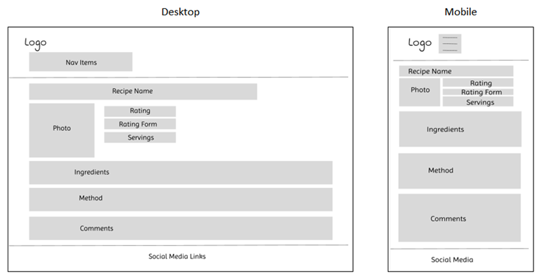

### User Recipes
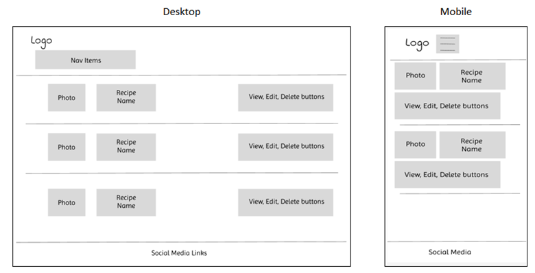

### Create and Edit Recipe

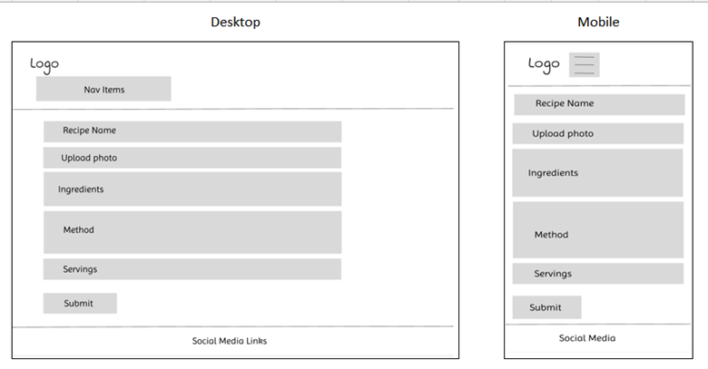

## Database Design

I used Lucid Chart to create my database schema

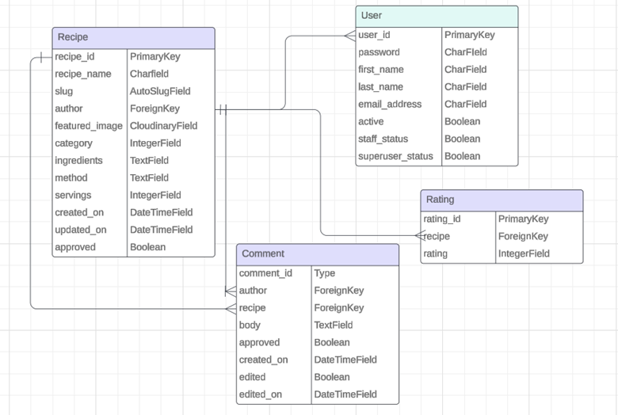

## Features

### Existing Features

#### Navigation Bar

- Features on all pages of the Sprout website
- Has links for Home, Register and Login when there is no authenticated user
- Has links to Home, Add Recipe, My Recipes and Logout when the user is authenticated
- Features the page logo which, if clicked, will navigated the user to the home page

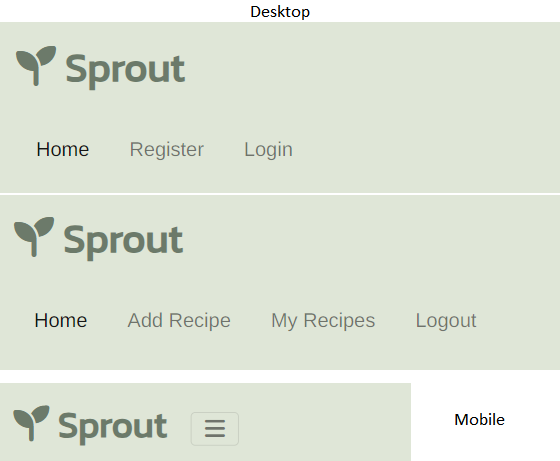

#### Footer

- Features on all pages of the Sprout website
- Has links to Facebook, X (Twitter), Instagram and LinkedIn
- The social media paged open in a new page

#### Home Page

- Has a hero image which contains a tagline
- This shows the user the ethos of the website and an understanding of what the website is
- The image was chosen as it is vibrant and communicates the wholefoods message

- Below the landing image is the library of recipes
- On an extra large device there will be four recipes shown on each row, three shown on a large device, two on medium devices and one on small devices

##### Pagination

- The home page is paginated and this section will tell the user which page they are one and how many pages there are
- If there are more than eight recipes there will be an arrow the user can press to take them to the next page
- On each page there will be a forward or page arrow depending on if there are more pages
- On the second page the hero image will disappear and the user will just see the recipes

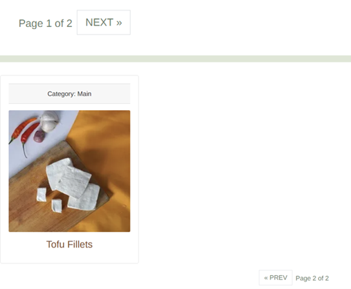

#### Add Recipe Page

- Contains a form for the user to add a recipe
- The form has the following fields:
  - Recipe Name – The name of the recipe – required 
  - Image – So the user can upload an image of their recipe – not required
  - Category – There are seven categories the user can choose from
  - Ingredients – These need to be added one per line to make them appear this way in the page. The placeholder tells the user to do this
  - Method – The placeholder tells the user to add a blank line between each method. This is how the recipe will show in the browser
  - Servings – This needs to be a positive number
  - Submit Recipe – When the user presses this the recipe will be submitted and the user will be redirected back to the home page

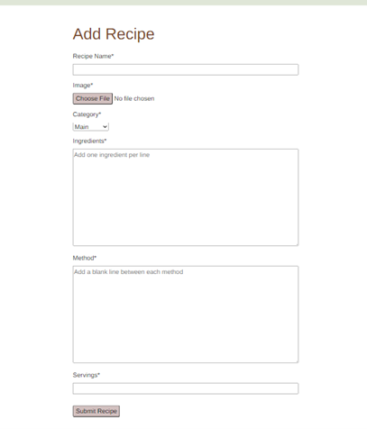

#### My Recipes

- Shows a list of all the logged in users recipes
- Each row contains:
  - An image of the recipe or the default image
  - The name of the recipe
  - The recipe rating or ‘No Ratings’ if the recipe has not yet been rated
  - View button – will take the user to a detailed view of the recipe
  - Edit Button – takes the user to the edit recipe form (below)
  - Delete Button – takes the user to a page asking them if they are sure they want to delete the recipe (see below)
- On screens smaller than 768px the buttons will wrap to the next line

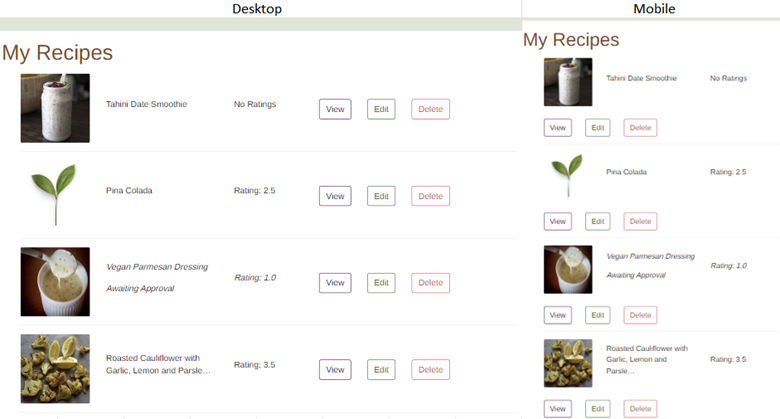

#### Recipe Detail Page

- The sections of this page are:
  - Recipe title
  - Image – this is the image the user uploaded. If they didn’t upload an image the default image will show
  - Rating – this is shown in stars and is calculated from the ratings users give. This is rounded to the nearest 0.5. The stars will colour up to the point of the rating (the rating shown in the photo is rated 3.5 stars. If there are no ratings ‘There are no ratings for this recipe’ will be displayed
  - Rating Form - A form for the user to add a rating – this must be an integer between 1 and 5
  - Submit Button – For the user to submit their rating
  - Servings
  - Ingredients – These will be displayed as the user entered them into the form. The user is instructed to enter one ingredient per line but they can still enter these as a block
  - Method – User is instructed to leave a blank line between each method, so that this is how it will be displayed. The user can enter the text anyway though – it will shown but won’t look as good
  - Comment Form – A form for the user to leave a comment. There is a hidden label as, the label was unnecessary to be shown on screen (the placeholder gives the instruction) but, the label is still needed for screen readers. If the iser is not logged in this form won't desplay and they'll be a comment that they need to sign in to leave a comment
  - Comments – The list of comments will display with a horizontal rule between each. All approved comments will be displayed. If the authenticated user it the one who left the comment but, it’s not approved, they will see this hear but shown it’s awaiting approval. If the comment is not approved and, it wasn’t written by the authenticated user, then it won’t show. The comment shows the date that the comment was written and, if the comment has been edited it will also show this
  - Edit Button – will take the user up to the form to edit their comment. This will be prepopulated with their current comment
  - Delete Button – shows a modal asking the user if they’re sure they want to delete their comment. If they pick ‘delete’ the comment will be deleted and if ‘cancel’ if won’t be. Either way they’ll be redirected back to the recipe detail page

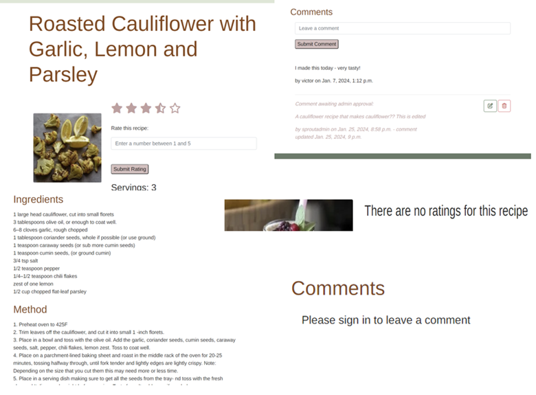

#### Edit Recipe

- Takes the user to the edit recipe form
- This is identical to the add recipe form except that it will display the current image
- The fields are all prepopulated

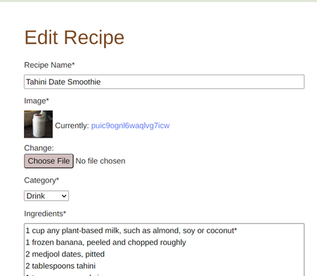

#### Delete Recipe

- Takes the user to a page asking if they are sure they want to delete the recipe
- It shows the name of the recipe
- The user has the option of delete or cancel
- If they press delete the recipe will be deleted and they will be directed back to the my recipes page
- If they press cancel they will be taken back to the my recipes page

#### Log In

- Form generated by allauth
- Styling has been added so the page blends with the rest of the website
- There is a link to take the user to the signup page if they are not yet registered
- The user can check the remember me box so their username and password will show next time, if they are on the same device
- The password is starred for security reasons

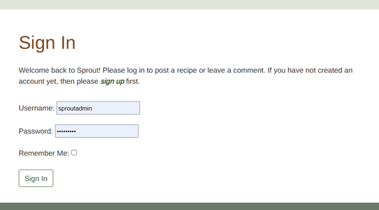

#### Sign Up

- Allows the user to register an account
- Contains a link to take the user to the login page if they are already authenticated
- Has checks to make sure the user doesn’t already exist, the passwords match and the password follows the guidelines stated

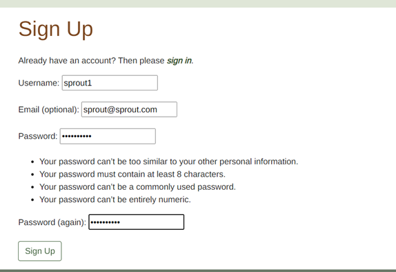

#### Log Out

- Allows the user to log out of their account
- If they choose ‘log out’ they will be signed out and direct to the home page
- If the choose ‘go to the home page’ they will not be logged and and redirected to the home page

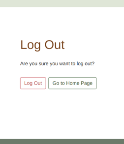

#### 404.html / 403.html / 500.html

- The same styling was used for all error pages. This is to keep consistency
- The 404 page will be displayed if the page is not found
- The 403 page will be displayed if the user tries to navigate to a page they do not have authority to access
- The 500 page will be displayed if there is an internal error

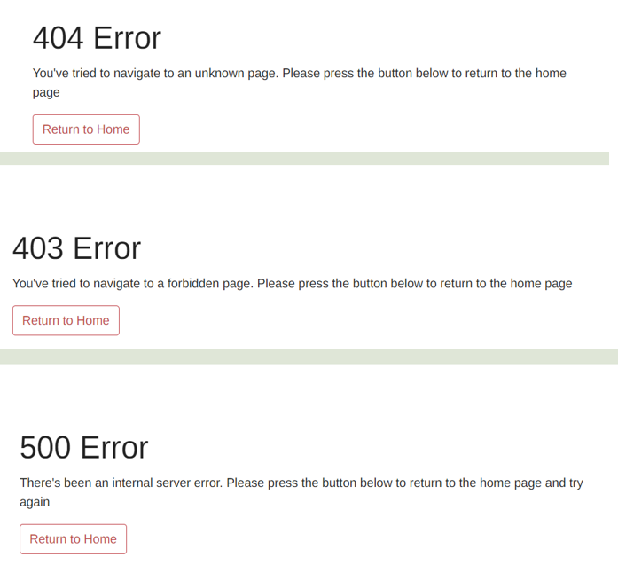

## Future Implementations

- A forgotten username or password be added to the log in page
- Rating to be shown on the recipe cards on the front page
- Functionality for the user to be able to like or dislike a recipe
- There to be an option to filter by recipe category
- Users to be able to search for a recipe
- Pagination to be changed so the user can click on a specified page rather than having to navigate page by page
- User to have the option to sort the recipes under different criteria
- The dimensions / size of an uploaded image to be limited or these to be automatically applied
- Uploaded images to automatically be changed to a webp format 
- Users to be able to like comments
- Users to have the ability to reply to a comment that has already been left
- Functionality for users to be able to direct message each other
- User to have the option to delete their account

## Accessibility

### Wave Validator

#### Home Page

- No errors

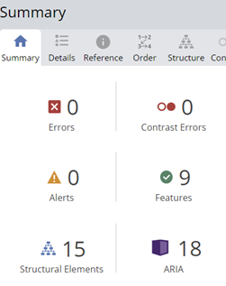

#### Recipe Detail

- One alert
- This is due to very small text and is in a hidden div that displays the rating numerically. This is only used for the ratings calculation and so will not be used by the user

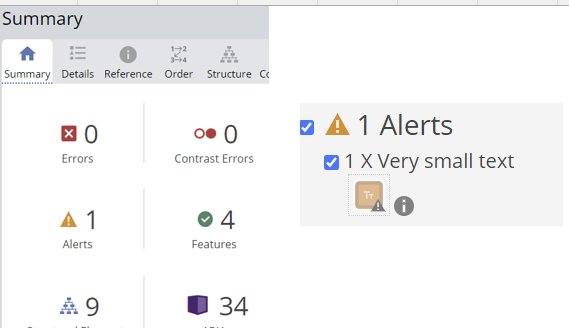

#### User Recipes
  
- No concerns

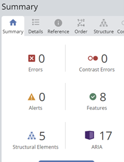

#### Create Recipe

- No concerns

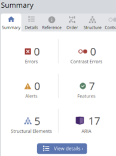

#### Edit Recipe

- No concerns

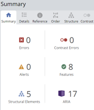

#### Delete Recipe

- One alert
- This is advising that there is a redundant link because the logo and home nav item are next to each other. I've decided to leave these as they are as, it's best practice for the logo to link to the home page but, it may not be obvious to all users it does this so, I think the link is needed in the navbar too

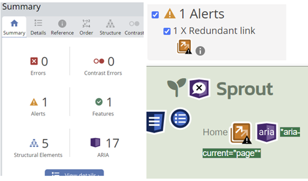

#### Log In

- No concerns

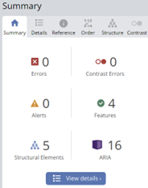

#### Sign Up

- One alert saying the link to the log in page is a redundant link
- This link is needed as it directs the user to the log in page. They can do this from the navbar too but, I think having the link here too makes the site more user friendly

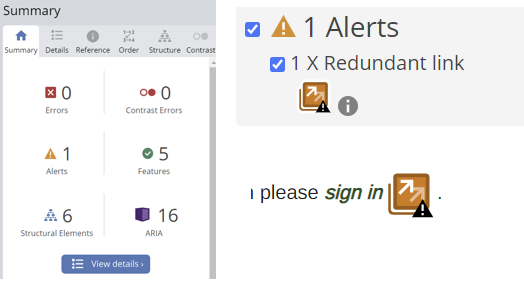

#### Log Out

- No concerns

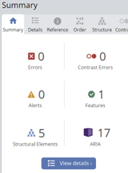

#### 404.html / 403.html / 500.html

- No concerns

[Back to top](#sprout)

# Technologies Used

## Languages Used

HTML, CSS, JavaScipt, Django and Bootstrap were used to create this website

## Frameworks, Libraries and Programs Used

- Allauth – for user authentication
- Am I Responsive? To show the website image on a range of devices
- Cloudinary – To upload and stores images in the cloud
- Codeanywhere – To write the code
- Convertio - To change images to webp format and reduce file size
- Crispy Forms – to automatically add styling to rendered forms
- ElephantSQL – to host the PostSQL database
- Figma – To create wireframes
- Font Awesome - For the iconography on the social media links
- Github - To save and store files
- Google Dev Tools – Used to troubleshoot and debug
- Google Fonts - To import the fonts used on the website
- JShint – to check for any issues in the JavaScript code
- Lucid Chart – To create the database schema
- Wave Validator – To check if improvement could be made for those users with disabilities
- WC3 Validator / Jigsaw – To check code meets the required standard
- Whitenoise – configures the Django project to serve it’s own staticfiles

## Deployment and Local Development

### Heroku

This site is deployed using Heroku and following these steps:
1.	Create a Heroku account or, if you already have one, log in
2.	Click the 'new' button and select 'create new app'
3.	Enter a unique name for your app and choose the region you are in
4.	Click 'create app'
5.	Click 'settings' and scroll down to 'Config Vars'. Click 'reveal Config Vars'
6.	In the box with the text 'KEY' type PORT and 8000 in the box with the text 'VALUE'
7.	Scroll to the next section, buildpacks and click 'add buildpack'. Add Python and NodeJS, in that order. Click 'Add Buildpack'
8.	Scroll back to the top of the page and click 'Deploy'
9.	Scroll to the Deployment method and choose Github
10.	In the next section, Connect to Github, type in your repository name. If you press the search button it'll bring up all your repositories. Connect to the correct repository
11.	Scroll down to the two sections for deployment (automatic deploys or manual deploys). The automatic deplays will update each time the 'git push' command is entered. For the maunal deploy, this will deploy the branch specified, in it's current state, when the 'Deploy Branch' button is clicked

### How to Fork

- Sign up and login to GitHub
- Find the GitHub repository https://github.com/Gkicks/sprout.git 
- Locate the “fork” button which is located towards the top of the page. Click this button

### How to Clone

- Sign up and login to GitHub
- Find the GitHub repository https://github.com/Gkicks/sprout.git 
- Locate the “<> Code” button and click this. This will bring up a new panel
- Click the local tab
- Decide if you would like to clone with HTTPS, SSH or GitHub CLI – copy the link shown under the one of your choosing
- Open your code editor
- Open a new terminal in your code editor and change the working directory to the location you want to use for the clone directory (you can use the cd command to change directories)
- When you are in your chosen directory type “git clone” followed by pasting in the URL you copied in GitHub
- Press enter to execute the command and your clone will be created

[Back to top](#sprout)

# Testing

Please refer to the testing information in the seperate [testing.md](/testing.md) file

[Back to top](#sprout)

# Bugs

## Resolved Bugs

**Bug**|**Resolution**
:-----:|:-----:
Category was showing as a number, rather than text, in index.html|Changed recipe.category to recipe.get\_category\_display (used Stack Overflow)
When putting margins on the recipe cards one recipe in the row was wrapping to the next line|Reconstructed the Django grid – needed extra divs to prevent this
Each card in the index.html was a different height|Added a class of h-100 to div
When pressing Signup nav item it was asking the user if they were sure they wanted to signout|The login.html page was the same as the signout.html page. Changed the login.html to be the correct version by copying and pasting the code for this page from GitHub
URL of add\_recipe page not being found|I’d only put the URL path as add\_recipe. Added blog/ in front of the URL path in urls.py
Getting the error message django.db.utils.DataError: value too long for type character varying(50) when trying to make migrations after changing slugfield to autoslugfield|This was due to an existing recipe having a longer slug than the default length. Added a max\_length=255 to autoslugfield and deleted the recipe that was causing the issue
Success message wasn’t showing|Followed the Django docs and added this code to the base.html page:  <ul class="messages">  <li class="{{ message.tags }}" > Important:  {{ message }} </li>  </ul>
Default images were not loading and it was showing a website for cloudinary|Unknown fix – it fixed itself on refresh!
Success message wasn’t showing after recipe created|Added message.success to the form\_valid function
The homepage was displaying recipes that were not yet approved|Added filter(approved=True) to the get\_queryset function
Changes I’d made to the static/CSS/style.css file weren’t being deployed|Ran the collectstatic command to update the staticfile with these changes. I realised afterwards it was because I had still got my Debug set to False
Edited recipe was showing as approved after being submitted|Added form.instance.approved = False to the class view
The user wasn’t being shown a success message when a recipe had been deleted|Added a def form\_valid() which contained the success message (used the Django 4.0 release notes)
When adding bootstrap classes the hero image wasn’t covering to the right edge of the page|Removed width=100% from CSS
My comment form wasn’t showing in the recipe\_detail.html webpage|I contacted student support who sent me a link, to Code Institute solutions GitHub repository, and suggested I look at putting in a def get() and a def post() in my DetailView. This is the webpage I used: https://github.com/Code-Institute-Solutions/Django3blog/blob/master/12\_final\_deployment/blog/views.py
The comment form wasn’t clearing when the user had left a comment so, the comment they had submitted was still showing|Added comment\_form = CommentForm() to the if statement, in the post function, to clear the form
When submitting the comment form was getting an error local variable ‘comment’ referenced before assignment|Set comment = None before the if statement
When adding a comment or rating, in the recipe\_detail view, whichever form was not submitted had a red border and an error message|Added  rating\_form = RatingForm() to the end of the if statement for posting the comment\_form and comment\_form = CommentForm() to the end of the if statement for posting the rating form
Comments were being duplicated when they were submitted and the website was refreshed|Added return HttpResponseRedirect(request.path\_info) to the end of the if statement
My average\_number variable, which shows the average rating for the recipe, wasn’t showing in the page, although was correct in the HTML|I contacted Student Support and they found the error – I’d spelt average as avergae!!
The placeholder, in the ratings form, was not responsive and could all be read on screens smaller than 435px|Added a form-control class to the input field and used a media query to reduce the font size on screens below this size
On the recipe\_detail page the ingredients and method was a block of text rather than broken down to different lines|Added | linebreaks 
A long comment was overflowing over the edge of the page|Added word-wrap: break-word as a CSS style
I was getting an error page 403 forbidden when pressing the button to delete a comment|Added  to the delete-modal form
When pressing the delete comment button, the comment wasn’t deleting and I was getting the error message from my edit\_comment view|I had put the name of the path, in urls.py as views.edit\_comment so I changed this to views.delete\_comment
There were several horizontal rules below the comment section|This is because my for loop was including all comments, including ones that weren’t displayed, due to not having been written by that user and not approved. I added an if statement, within the for loop, to only iterate over comments that were approved or written by the user
The ingredients and method fields, in the form to create a recipe, had changed to be a single line when it needed to be a multiline|When I’d used widgets, to add a placeholder, I’d put widget=forms.TextInput, which only renders a single line. Changed this to  widget=forms.Textarea which is multiline
The error ‘Uncaught TypeError: Cannot read property of undefined’ was showing, in the console, for javascript functions that weren’t being run on that page|I added if statement to all the functions so that they would only run when the page they corresponded to was loaded
Having a button on my delete recipes page, that was supposed to cancel the deletion, was still deleting the recipe|Changed the button to an <a> tag
The footer wasn’t at the bottom of the page on those pages with low content|I used a calculation that removed the height of the navbar and footer form 100vh. This was following advice in this forum https://theme.co/forum/t/footer-content-overlapping-with-main-content/73859/5
In the edit recipe view they was a div saying ‘current image’ but this was empty|I went through Student support and realised that I would have to overwrite the crispy form. I did this and then restyled the forms
There was a number showing after the date of the edited comment|In my recipe detail page, {{ comment id }} was showing after the editedon 
In the my recipes page the text of the unauthorised recipes was showing as dark grey and it should be pink|There was another class overwriting the faded class as, the faded class was close to the top of the style.css page. Moved this class towards the bottom
The user could leave a blank name for the recipe|Added blank=False to the recipe\_name field in the models.py tab
In the receipe detail, for recipe with 1.5 star rating, one star wasn't showing and two were showing as squares|There were two missing apotrophies, in the class names, in JavaScript
An unauthenticated could enter a comment but this then caused a 500 error|Added an if statement to check is the user was authenticated before displaying the comment input
Two recipes with the same name but different capitalisation can be created. This meant two of the same slugs being created and 500 errors when the duplicated slug recipe was clicked on|Added slug=unique to model
When submitting a comment less than 3 characters the form wasn't submitting but the user wasn't getting a message to say why|I could have added a form\_invalid function but, I chose to remove this validator - it's possible a user may only want to leave a 1 character comment, such as ?, or a number, in reply to another comment
The form wasn't submitting when a nuber enetered below 1 for servings however, the user wasn't getting a meesage to say why|Added a form\_invalid function, to the createView and updateView classes

## Unresolved Bugs

- The slugfield isn't automatically updating in the admin panel - this shouldn't be an issue in deployment as CRUD functionality can all be done through the website. However, it would be something I would have researched more if I'd had more time
- Users can enter one block of text, into the ingredients and method fields, of the create / edit recipe form. I couldn’t think of a way to validate this but, would again would be something to research further if I had more time
- The view recipe button is still showing as a yellow border when clicked and held. I’ve added more css which has made it better (it was showing as background colour yellow too before) and not completely resolved it. 

[Back to top](#sprout)

# Credits

## Code Used

For my EditComment function I heavily relied on the lesson from Code Institute’s ‘I Think Therefore I Blog walkthrough

## Content

All content was written by Gail Kicks

## Media

All photos were taken from the websites pixabay.com and upsplash.com

The recipes used were from:

- Chickpea Flour Pizza - https://www.forksoverknives.com/
- Pancakes - https://www.peta.org.uk/
- Pina Colada - https://lovingitvegan.com/
- Roasted Cauliflower with Garlic, Lemon and Parsley - https://www.feastingathome.com/
- Smoky Tender Aubergine - https://www.jamieoliver.com/
- Tahini Date Smoothie - https://www.vegkit.com/
- Tofu Fillets - https://itdoesnttastelikechicken.com/
- Vegan Christmas Pudding - https://www.bbcgoodfood.com/
- Vegan Fish Sticks - https://www.vegkit.com/
- Vegan Parmesan Dressing - https://monkeyandmekitchenadventures.com/

## Other

I used the following resources to learn and debug

- The Code Institute lessons, including the ‘I Think Therefore I Blog’ walkthrough
- The Ultimate 2023 Fullstack Web Developer Bootcamp on Udemy
- stackoverflow.com
- Code Institute’s Slack community
- Codeacademy forum
- Django Documentation
- Getbootstrap.com
- MDN Web Docs
- geeksforgeeks.org
- youtube.com

## Acknowledgements

- My mentor, Graeme Taylor, for his advice and guidance
- The Code Institute Slack community
The Code Institute tutors – especially Joanne, Jason, Rebecca and Sarah 

[Back to top](#sprout)