# Testing

# Contents
- [Testing](#testing)
- [Contents](#contents)
- [Manual Testing](#manual-testing)
  - [PEP8 Validation](#pep8-validation)
  - [WC3 Validator](#wc3-validator)
  - [Jigsaw Validator](#jigsaw-validator)
  - [Full Testing](#full-testing)
    - [Home Page](#home-page)
    - [Recipe Detail](#recipe-detail)
    - [My Recipes](#my-recipes)
    - [Add / Edit Recipe](#add--edit-recipe)
    - [Sign Up](#sign-up)
    - [Log In](#log-in)
    - [Log Out](#log-out)
    - [Unauthorised Access](#unauthorised-access)
  - [Lighthouse testing](#lighthouse-testing)
    - [Home Page](#home-page-1)
    - [Recipe Detail](#recipe-detail-1)
    - [User Recipes](#user-recipes)
    - [Create Recipe](#create-recipe)
    - [Edit Recipe](#edit-recipe)
    - [Delete Recipe](#delete-recipe)
    - [Log In](#log-in-1)
    - [Sign Up](#sign-up-1)
    - [Log Out](#log-out-1)
  - [User Stories](#user-stories)
    - [Epic 1 – Initial Setup](#epic-1--initial-setup)
    - [Epic 2 – Create Pages](#epic-2--create-pages)
    - [Epic 3 – Recipes](#epic-3--recipes)
    - [Epic 4 – Comments](#epic-4--comments)
    - [Epic 5 – Authentication](#epic-5--authentication)
    - [Epic 6 – Deployment](#epic-6--deployment)
    - [Epic 7 – Testing and Documentation](#epic-7--testing-and-documentation)
  - [Automated Testing](#automated-testing)

# Manual Testing

## PEP8 Validation

I ran my code throught the [Code Institute Python Linter](https://pep8ci.herokuapp.com/). This showed no errors:

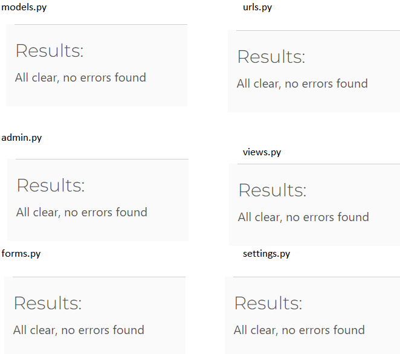

## WC3 Validator

I ran the following pages hhrough the WC3 validator. Due to the validator not being able to work with Django tags, I copied the html from the source code for each page, on the deplyed website

- index.html
- recipe_detail.html
- my_recipes.html
- create_recipe.html
- confirm_delete.html
- logout.html
- login.html
- signup.html
- 404.html
- 403.html
- 500.html

All pages but two returned:

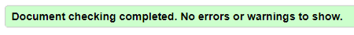

There were two pages that returned errors:

- index.html

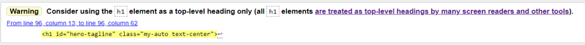

This was relating to the tagline that shows over the hero image. I did consider changing the H1 but, then errors were raised in the Wave validator as there was no header. I dedided to keep this as an H1 as the accessibility is important.

- create_recipe.html

This warning is because the tag is empty. This is filled, using JavaScript, depending on if a create_recipe ot edit_recipe form is called. Therefor, it won't be an empty tag

## Jigsaw Validator

I ran my CSS code through the Jigsaw validator. This returned no errors

## Full Testing

I tested the site in these browsers:

- Google Chrome
- Microsoft Edge
- Firefox

I also tested for responsiveness, through Chrome's developer tools, on the following devices:

- iPhone SE
- iPhone XR
- iPhone 12 Pro
- Pixel 5
- Samsung Galaxy S8+
- Galaxy S20 Ultra
- iPad Air
- iPad Mini
- Surface Pro 7
- Surface Duo
- Galaxy Fold
- Samsung Galaxy A51/71
- Nest Hub
- Nest Hub Max
- iPhone 6/7/8
- Facebook for Android v407 on Pixel 6 Of these, the narrowest screensize was the Galaxy Fold so I made sure the website was responsive down to this size. I have a Galaxy Fold 4 so also tested the website on this device.

The only issues I found were that,on the iPad devices, the footer wasn't always at the bottom of the page. This is a bug I would try to resolve had I had more time.

### Home Page

**Test**|**Expected Outcome**|**Test Keyed (if applicable)**|**As expected?**|**Pass**
:-----:|:-----:|:-----:|:-----:|:-----:
On page load|There should be a library of recipes, sorted in date created order, with the most recent first|N/A|Yes|Yes
Logo clicked|Home page refreshed|N/A|Yes|Yes
Home nav item clicked|Home page refreshed|N/A|Yes|Yes
Sign Up nav item clicked|Opens Sign Up form|N/A|Yes|Yes
Sign In nav item clicked|Opens Log In form|N/A|Yes|Yes
Hover over recipe photo|Recipe name changes to green|N/A|Yes|Yes
Hover over recipe name|Recipe name changes to green|N/A|Yes|Yes
Click recipe photo|Take to the recipe detail view for that recipe|N/A|Yes|Yes
Click recipe name|Take to the recipe detail view|N/A|Yes|Yes
8 or less approved recipes in the library|Pagantion section to say page 1 of 1|N/A|Yes|Yes
More than 8 approved recipes in the library|Pagination section to say 1 of no. pages and there be a next arrow|N/A|Yes|Yes
Next button clicked from Page 1|Taken to the next page. Hero image not be showing. Pagnation section should  say page 2 of no. of pages and a previous button should be showing|N/A|Yes|Yes
Previous button clicked from Page 2|Taken back to page 1. Hero image should return|N/A|Yes|Yes
Facebook icon clicked|Opens Facebook in a new tab|N/A|Yes|Yes
X (Twitter) icon clicked|Opens X in a new tab|N/A|Yes|Yes
Instagram icon clicked|Opens Instagram in a new tab|N/A|Yes|Yes
LinkedIn icon clicked|Opens LinkedIn in a new tab|N/A|Yes|Yes

### Recipe Detail

**Test**|**Expected Outcome**|**Test Keyed (if applicable)**|**As expected?**|**Pass**
:-----:|:-----:|:-----:|:-----:|:-----:
Parmesan Dressing recipe page loaded|Star rating shows 1 star|N/A|Yes|Yes
Pancakes recipe page loaded|Star rating shows 1.5 star|N/A|Yes|Yes
Fish Sticks recipe page loaded|Star rating shows 2 star|N/A|Yes|Yes
Pina Colada recipe page loaded|Star rating shows 2.5 star|N/A|Yes|Yes
Aubergine recipe page loaded|Star rating shows 3 star|N/A|Yes|Yes
Cauliflower recipe page loaded|Star rating shows 3.5 star|N/A|Yes|Yes
Pizza recipe page loaded|Star rating shows 4 star|N/A|Yes|Yes
Tofu Fillets recipe page loaded|Star rating shows 4.5 star|N/A|Yes|Yes
Christmas Pudding recipe page loaded|Star rating shows 5 star|N/A|Yes|Yes
Enter number between 1 and 5 in the rate recipe input and press the submit button below|Message to appear at the top of the page saying 'Thank you. Your rating has been submitted'|2|Yes|Yes
Negative number entered into rating input|Error message to be displayed|-1|Yes|Yes
Positive integer, not in the range 1-5, entered into rating input|Error message to be displayed|8|Yes|Yes
Ingredients displayed|To be displayed in the way entered to the form|N/A|Yes|Yes
Method displayed|To be displayed in the way entered to the form|N/A|Yes|Yes
Comment entered into comment form and submit comment button clicked|Message to appear at the top of the page saying 'Comment submitted and awaiting approval'. Comment to be shown in the comment list and be coloured pink. To be a paragraph saying 'comment awaiting admin approval'. Comment body shown, the author and the date and time the comment was posted|String|Yes|Yes
Comment submit button pressed with empty comment input|Error message to be displayed|" "|Yes|Yes
Comment, written by another user, that is approved|Not be displayed|N/A|Yes|Yes
Comment, written by another user, that is not approved|Not be displayed|N/A|Yes|Yes
Comment, written by the authenticated user, that is approved|Comment displayed in grey with two buttons to edit or delete comment|N/A|Yes|Yes
Comment, written by the authenticated user, that is not approved|Comment displayed in pink with two buttons to edit or delete comment|N/A|Yes|Yes
Edit comment button pressed|User to be taken to the comment input. The comment input to have a dark green border and to have increased in height. The submit comment button to now read 'update'. Current comment displayed in input field|N/A|Yes|Yes
Comment edited and update button clicked|Message to be displayed 'Comment updated and awaiting approval'. Comment to be in non-approved format. Date and time comment updated to be added to the comment|N/A|Yes|Yes
Edited comment submitted as empty string|Error message to be displayed|" "|Yes|Yes
Edited comment submitted as less than three characters|Error message to be displayed|zy|Yes|Yes
Delete comment button clicked|Modal to appear asking the user if they are sure they want to delete the comment|N/A|Yes|Yes
Delete pressed on the modal|Modal to disappear. Message to be displayed 'Your comment has been deleted' and comment to no longer show|N/A|Yes|Yes
Cancel pressed in the modal|Modal to disappear|N/A|Yes|Yes

### My Recipes

**Test**|**Expected Outcome**|**Test Keyed (if applicable)**|**As expected?**|**Pass**
:-----:|:-----:|:-----:|:-----:|:-----:
List of recipes displayed by authenticated user|Only recipes by authenticated user displayed|N/A|Yes|Yes
Recipes awaiting approval displayed|Displayed in pink italics and informing the user they are awaiting approval|N/A|Yes|Yes
Ratings column displayed|Correct rating to be shown for each recipe|N/A|Yes|Yes
View button hover|Background to turn purple, writing to be white|N/A|Yes|Yes
Edit button hover|Background to turn green writing to be white|N/A|Yes|Yes
Delete button hover|Background to turn red writing to be white|N/A|Yes|Yes
View button pressed|User taken to the recipe detail page|N/A|Yes|Yes
Edit button pressed|User taken to the edit recipe page|N/A|Yes|Yes
Delete button pressed|User taken to the delete recipe page|N/A|Yes|Yes

### Add / Edit Recipe

**Test**|**Expected Outcome**|**Test Keyed (if applicable)**|**As expected?**|**Pass**
:-----:|:-----:|:-----:|:-----:|:-----:
All fields filled with valid data|User directed to the home page. Message saying 'TBC' to appear| | | 
Empty string enter in recipe name|Error message|" "|Yes|Yes
Recipe name entered that already exists in the database|A unique slug to be generated|N/A|Yes|Yes
Name longer than 255 characters entered|Cannot be entered|N/A|Yes|Yes
Choose file clicked|User taken to their directory to choose an image|N/A|Yes|Yes
Category shown|Showing main as default|N/A|Yes|Yes
User chooses another category from drop down|This category is chosen|N/A|Yes|Yes
Empty string enter in ingreidients|Error message|" "|Yes|Yes
Empty string enter in method|Error message|" "|Yes|Yes
Negative number entered into servings|Error message - no message|-5|Yes|Yes
0 entered into servings|Error message - no message|0|Yes|Yes
Letter entered into servings|Cannot be entered|d|Yes|Yes
Special character entered into servings|Cannot be entered|£|Yes|Yes

### Sign Up

**Test**|**Expected Outcome**|**Test Keyed (if applicable)**|**As expected?**|**Pass**
:-----:|:-----:|:-----:|:-----:|:-----:
All inputs completed with valid data|Taken to the home page. Message displayed 'Signed in as newuser'|N/A|Yes|Yes
username field left blank|Error message|" "|Yes|Yes
username entered that is already in the database|Error message|sproutadmin|Yes|Yes
Invalid email format entered|Error message|aaass|Yes|Yes
Passwords don't match|Error message|N/A|Yes|Yes
Password same as username|Error message|N/A|Yes|Yes
Password less than 8 characters|Error message|Abcd1|Yes|Yes
Common password entered|Error message|password|Yes|Yes
Numeric password entered|Error message|12341234|Yes|Yes
Sign in link clicked|Taken to log in page|N/A|Yes|Yes

### Log In

**Test**|**Expected Outcome**|**Test Keyed (if applicable)**|**As expected?**|**Pass**
:-----:|:-----:|:-----:|:-----:|:-----:
Correct username and passwork entered|Taken to the home page|N/A|Yes|Yes
Username field blank, correct password|Error message|N/A|Yes|Yes
Password field blank, correct username|Error message|N/A|Yes|Yes
Sign up link clicked|Taken to the sign up page|N/A|Yes|Yes

### Log Out

**Test**|**Expected Outcome**|**Test Keyed (if applicable)**|**As expected?**|**Pass**
:-----:|:-----:|:-----:|:-----:|:-----:
Hover on logout button|Background red and writing white|N/A|Yes|Yes
Hover on go back home button|Background green and writing white|N/A|Yes|Yes
Click on logout button|Redirected to the home page. Message shown 'You have signed out'. Is logged out|N/A|Yes|Yes
Click on go back home button|Redirected to the home page. Remains logged in|N/A|Yes|Yes

### Unauthorised Access

**Test**|**Expected Outcome**|**Test Keyed (if applicable)**|**As expected?**|**Pass**
:-----:|:-----:|:-----:|:-----:|:-----:
Can an unauthenticated user create a recipe|Taken to log in page|N/A|Yes|Yes
Can an unauthenticated user edit a recipe|Taken to log in page|N/A|Yes|Yes
Can an unauthenticated user delete a recipe|Taken to log in page|N/A|Yes|Yes
Can an unauthenticated user create a comment|Taken to log in page|N/A|Yes|Yes
Can an authenticated user edit a recipe they didn't author|403 Error|N/A|Yes|Yes
Can an authenticated user delete a recipe they didn't author|403 Error|N/A|Yes|Yes

[Back to top](#testing)

## Lighthouse testing

I ran all code through Lighthouse in Chrome Developer Tools. There were some concerns, in the home page, regarding image sizes. Limiting image sizes is one of my future implications as I believe this can be improved.

### Home Page

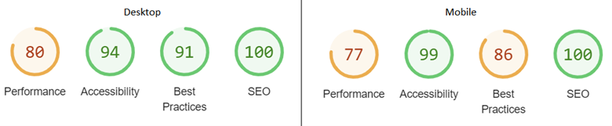

### Recipe Detail

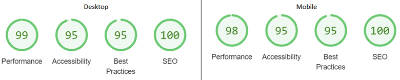

### User Recipes
  

### Create Recipe

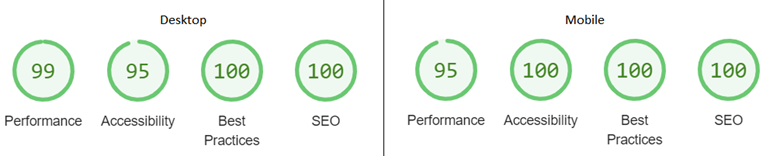

### Edit Recipe

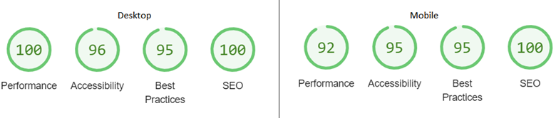

### Delete Recipe

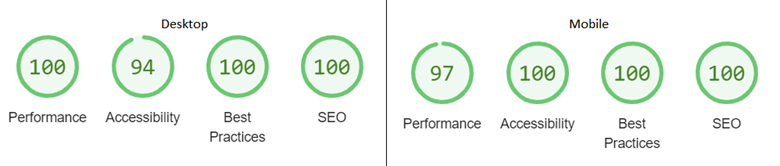

### Log In

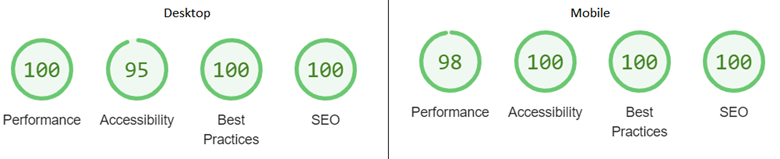

### Sign Up

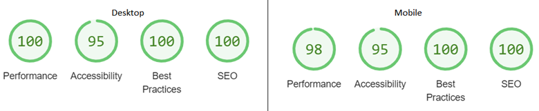

### Log Out

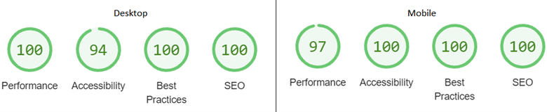

## User Stories

### Epic 1 – Initial Setup

**User Story**|**How is this Achieved?**
:-----:|:-----:
As a developer I need to create a PostgresSQL instance, using ElephantSQL, so I can set up models|This has been set up through ElephantSQL
As a developer I need to set up the developing environment so that I can implement the necessary features|The developing environment was set up at the start of the project
As a developer I need to create a superuser so I can have admin access to the database|There is a superuser in place
As a developer I need to create static resources to contain my css and js files and images|Staticfiles are in place and these are served using Whitenoise

### Epic 2 – Create Pages

**User Story**|**How is this Achieved?**
:-----:|:-----:
As a developer I need to create the base.html page to give the structure that other page layouts are based on|Base.html page in place
As a developer I need to create a navbar so that the user can navigate throughout the site|Navbar in place with links to home, sign up, sign in and log out
As a developer I need to create a footer so that the user can link to the social media accounts|Footer in place with links to Facebook, X (Twitter), Instagram and LinkedIn
As a developer I need to create a home / landing page where the user can easily see the recipe posts|Landing page in place which shows a library of recipes
As a user I want to see a list of my current recipes so I can see the recipes I've published and choose which to edit or delete |My Recipes page in place where user can see a list of their recipes
As a developer I want to create a 404 error page so that users are alerted if they have accessed a page that doesn’t exist|404 page in place
As a developer I want to create a 403 error page so that users are alerted if they have accessed a page they don't have permission to view |403 page in place
As a developer I want to create a 500 error page so that users are alerted if an internal error occurs|500 page in place

### Epic 3 – Recipes

**User Story**|**How is this Achieved?**
:-----:|:-----:
As a user I want to create a recipe post so that I can share my recipe with other users|An authenticated user is able to post a recipe
As a user I want to click on a recipe post which will open in a new page so I can see the full recipe|All users are able to see the details of a recipe
As a user I want to edit a recipe so I can correct any errors or make updates|Authenticated users can edit their own recipes
As a user I want to delete a recipe so I can stop sharing it with other users|Authenticated users can delete their own recipes
As a user I want to filter by type of recipe (main, sides, etc) so I can just see the recipes for want I am planning to make|This was not achieved and is a future implementation
As a user I want to like or dislike a recipe to help other users make a decision about making a recipe|This was not achieved and is a future implementation
As a user I want to search for a recipe to find a recipe if I already have an idea of what I’m looking for|This was not achieved and is a future implementation
As a user I am able to rate a recipe to inform others how much I liked the recipe|Rating form in place rating displayed, in stars, on the recipe detail page

### Epic 4 – Comments

**User Story**|**How is this Achieved?**
:-----:|:-----:
As a user I want to comment on a recipe so I can give feedback to the author and share my views with other users|Authenticated users are able to leave comments on any recipe
As a user I want to view comments that all users have left so that I can see feedback on a recipe|All users can view comments left on a recipe
As a user I want to edit a comment so I can correct any errors or make updates|Authenticated users can edit their own comments
As a user I want to delete a comment so I can stop sharing it with other users|Authenticated users can delete their own comments
As a user I want to like comments to help other users make a decision how helpful that comment is|This was not achieved and is a future implementation

### Epic 5 – Authentication

**User Story**|**How is this Achieved?**
:-----:|:-----:
As a developer I need to install allauth so the user can register an account, login and logout|Allauth installed. Signup, login and logout pages are all in place
As a site owner I want the allauth forms to be customised so they fit in with the style of the rest of the site|All forms have been customised to match the design of the website
As a user I want to delete my account so it no longer exists|This was not achieved and is a future implementation

### Epic 6 – Deployment

**User Story**|**How is this Achieved?**
:-----:|:-----:
As a developer I need to deploy the project, to Heroku, so that customers are able to access the website|The project has been deployed to Heroku

### Epic 7 – Testing and Documentation

**User Story**|**How is this Achieved?**
:-----:|:-----:
As a developer I want to complete automated testing so I can make sure all area of the website are working as they should be|There are 11 automated tests in place
As a developer I need to write a README so that all information regarding the project is easily understood by those who need to|README in place
As a developer I would like to get feedback from other users so I can see if my project is commercially viable|This was not achieved due to time constraints

## Automated Testing

I wrote 11 tests to test the form inputs were veing validated as they should be

**Test**|**As expected?**|**Pass**
:-----:|:-----:|:-----:
Does the add recipe form submit when all valid data is added|Yes|Yes
Will the add recipe form submit if the recipe name field is empty|Yes|Yes
Will the add recipe form submit if the recipe name has a name of more than 255 characters|Yes|Yes
Does the add comment form submit when all valid data is added|Yes|Yes
Will the add comment form submit if the body field is empty|Yes|Yes
Does the add rating form submit when all valid data is added|Yes|Yes
Will the add rating form submit if the rating field is empty|Yes|Yes
Will the add rating form submit if the rating is higher than 5|Yes|Yes
Will the add rating form submit if the rating is a negative number|Yes|Yes
Will the add rating form submit if the rating is a letter|Yes|Yes
Will the add rating form submit if the rating is a special character|Yes|Yes

I understand that, in a real world situation, I would be expected to test all areas by writing tests